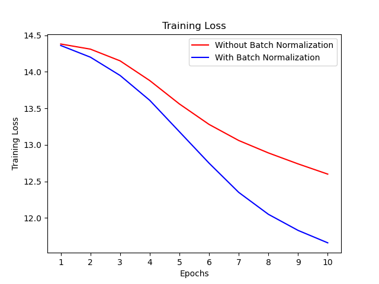
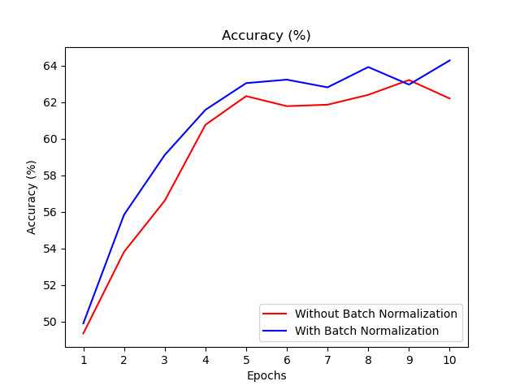
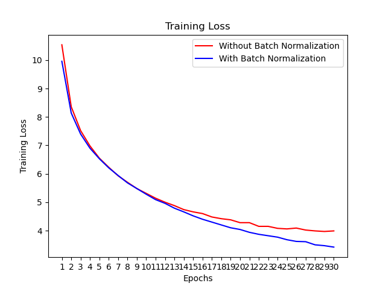
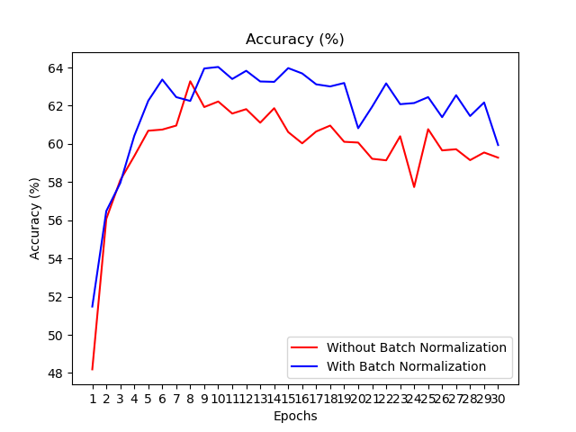

### Summary : Experiments and Results

| Experiment |    Model   | Optimizer | Batch Normalization |    Epochs     |  Training time   | Accuracy |
|------------|------------|-----------|---------------------|---------------|-----------------|----------|
|    1       |    fixed   |   Adam    |        Without         |       10        |  0:09:14.916     |   10%    |
|    2       |  improved  |   Adam     |     without         |    10         | 0:08:37.861316s |   29.41%    |
|    3       |  improved  |   Adam     |       with         |    10         | 0:10:09.145497s |   30.32%    |
|    4       |  improved  |   Stochastic Gradient Descent (SGD)     |       Without         |    10         | 0:07:08.245559s |   62.21%    |
|    5       |  improved  |   Stochastic Gradient Descent (SGD)    |        With         |    10         | 0:08:14.597915s |   64.29%    |


### Improvement
| Improved part |  Applied Experment    |   Explanation  |
|---------------|-----------------------|-----------------|
| batch size    |  experiment 2,3,4,5   | The initial batch size was 1000. I reduced the batch size as 4 which shows better accuracy.
| Simpler Network | experiment 3,4,5    | The initial network has redundant layers in both convolutional layers and linear layers. I simplified the network which performs better|
| Optimizer     | experiment 4, 5      | I used Stochastic Gradient Descent (SGD) instead of Adam. The accuracy is improved significantly |
| Batch Normalization | experiment 5  | Applying Batch Normalization in the Convolutional Layer showed improved performance than model in experiment 4|
| gpu           |  experiment 3,4,5   | Using gpu makes (of course) the training faster |


### Training loss 

| Optimizer | Training Loss |
|-----------|---------------|
|  SGD        |  |
| Adam          |  |


### Accuracy

| Optimizer |  Accuracy   |
|-----------|---------------|
|   SGD        |  |
|   Adam    | .png) |


### Batch size 
In general smaller or larger batch size doesn't guarantee better convergence. In theory, bigger the batch size, lesser is the noise in the gradients. Therefore, it is better for the quick gradient estimate. However, this challenge performed better with smaller batch size. Besides, the bigger batch size needs more memory and each step is time consuming. Therefore, the batch size 4 performs significantly better. 


### Batch Normalization
 Batch Normalization is known for accelerating Deep Neural Network training by reducing internal covariate Shift within images.
 In this challenges, the batch normalization improved the accuracy. 
 If you look at the training loss with batch normalization, it converged faster than without batch normalization.
 I can conclude that applying batch normalization in this classification problem imrpoves the performance of the model.

code 
```
class BN_Model(nn.Module):
    def __init__(self):
        super().__init__()
  
        self.conv1 = nn.Conv2d(3, 6, 5) #input channel, output_channel, kernel_size
        self.pool = nn.MaxPool2d(2, 2)
        self.bn1 = nn.BatchNorm2d(6) # batch normalization is applied only before second convolutional layer
        self.conv2 = nn.Conv2d(6, 16, 5)
        self.fc1 = nn.Linear(16 * 5 * 5, 120)
        self.fc2 = nn.Linear(120, 84)
        self.bn2 = nn.BatchNorm1d(84)
        self.fc3 = nn.Linear(84, 10)
	   
	   
    def forward(self, x):
        x = self.pool(F.relu(self.conv1(x)))
        x = self.bn1(x)
        x = self.pool(F.relu(self.conv2(x)))
        x = torch.flatten(x, 1) # flatten all dimensions except batch
        x = F.relu(self.fc1(x))
        x = F.relu(self.fc2(x))
        x = self.fc3(x)
        return x
```
 

### Epoch 
I observed that the training with 10 epochs peaks the accuracy, although the training loss was continuously decreasing after epoch 10. 
Therefore, the experiment is conduced with 10 epochs. 
The following is the training loss and accuracy in training with epoch 30. 



### Future improvement 
1. I will apply the learning rate scheduler. Therefore, the learning rate can be adapted during training. This will helps SGD moves stabler.
2. I would like to collect statisitics on class imbalance - to check whether particular image classes are more dominant than other classes. If I find any imbalanced class, I will add more training images with image augmentation technique.
3. I would like to use different loss function for training to see whether the different loss function helps the performance.
4. The improved model is implemented using simpler network than orginal model. Moreover, the state-of-the art network for image classification such as model using Transformer with Attention model can be used in image classification problem. It would be interesting to see how these latest models work for CIFAR 10 dataset. 
7. I would like to try to train the model with parallel mode (with multiple GPUs).  


